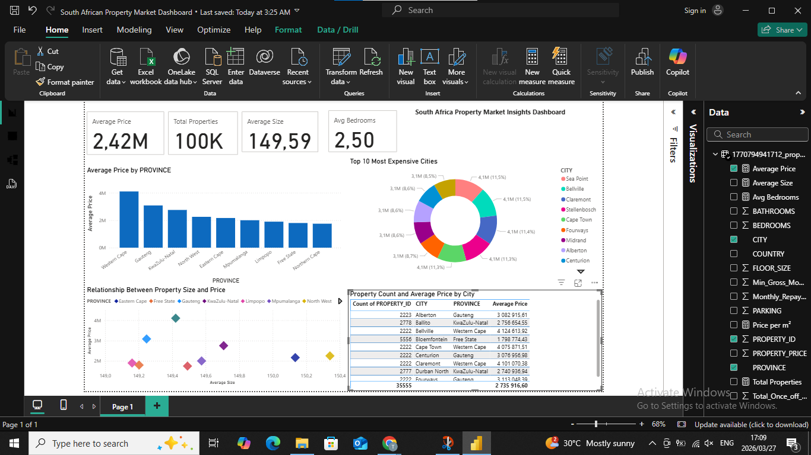

# South Africa Property Market Insights Dashboard

A comprehensive Power BI dashboard analyzing residential property data across South Africa, providing actionable insights for data-driven decision-making in the real estate sector.

## 📊 Project Overview

This project is a continuation of my [SQL mini project](https://github.com/TebogoLesedi1/SQL-Property-Data_), where I analyzed a large residential property dataset. In this phase, I transformed the raw data into an interactive, visually compelling dashboard using Power BI to uncover market trends and patterns.

## 🎯 Key Features

- **Interactive Dashboard** with KPIs, filters, and drill-down capabilities
- **Price Analysis** by province and city to identify market trends
- **Top 10 Most Expensive Cities** ranking for investment insights
- **Size-Price Correlation** analysis to understand property valuation drivers
- **Geographic Distribution** of properties and pricing patterns across regions
- **Dynamic Filtering** capabilities for detailed market exploration

## 📈 Key Insights

- **Western Cape** leads with the highest average property prices
- **Gauteng** dominates with the highest number of property listings
- **Positive Correlation** between property size and market price
- **Concentrated High-Value Properties** in specific urban centers

## 🛠️ Tools & Technologies

| Technology | Usage |
|-----------|-------|
| **Power BI** | Interactive dashboard creation and visualization |
| **SQL** | Data extraction, cleaning, and analysis |
| **DAX** | Advanced data modeling and calculations |

## 📁 Files Included

| File | Description |
|------|-------------|
| `South African Property Market Dashboard.pbix` | Main Power BI dashboard file with all visualizations and data models |
| `dashboard1.png` | Dashboard preview screenshot |
| `README.md` | Project documentation |

## 🎨 Dashboard Preview

*Interactive visualizations showing property distribution, pricing trends, and market analysis across South African cities and provinces.*

## 🔗 Related Projects

- **[SQL Property Data Analysis](https://github.com/TebogoLesedi1/SQL-Property-Data_)** - The foundational SQL analysis project that informed this dashboard

## 💡 How to Use

1. Download or clone the repository
2. Open `South African Property Market Dashboard.pbix` in Power BI Desktop
3. Interact with the dashboard filters to explore different regions and price ranges
4. Use the visualizations to identify market opportunities and trends

## 📧 Contact & Opportunities

**Tebogo Lesedi**

I'm open to opportunities in:
- 📊 Data Analytics
- 🤖 Data Science
- 💼 Business Intelligence

Feel free to reach out for collaboration or inquiries!

---

*Last Updated: May 2026*
